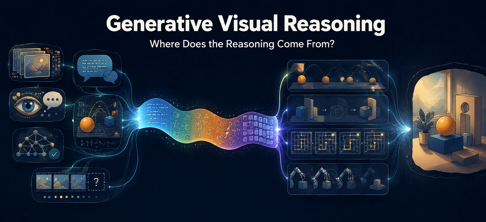

# Awesome Generative Visual Reasoning

*A curated list of works on **generative visual reasoning**: using image and video generation to solve visual problems, rather than to depict them.*

This repository is the paper list for the survey **Where Does the Reasoning Come From? A Survey of Generative Visual Reasoning**.

## Overview

Generative models are increasingly asked to **solve** visual problems rather than depict them, and the results are uneven in a way that is rarely explained: a video model will infer material properties and solve a maze it was never trained on, and will then let a ball roll off a table and drift sideways. We organise the field by the question that explains the gap — **where does the reasoning competence actually come from?** Six sources appear in the literature and they are not interchangeable. The medium in which a method writes its intermediate state, which we call the **carrier**, runs across those sources as a thread rather than forming a second hierarchy: a simulator has no choice about how to hand over its answer, while a multimodal model has four.

Crossing the six sources with a classification of the reasoning tasks themselves gives the survey's main result. **Formal rule-following is the most verifiable class of task in the field and is well supplied with benchmarks, yet not one of the 153 methods reviewed targets it, under any source.** The classification predicts this rather than merely recording it: a constraint that can be stipulated as a rule can usually be discharged in symbols, and generating pixels to solve a problem that symbols already solve has nothing to recommend it. That turns an apparent hole in the literature into a boundary — and, read the other way, into a statement of which tasks generative visual reasoning is actually the right instrument for ([§1.2](#1.2.)).

> **Definition.** A system performs **generative visual reasoning** on a task when it emits visual content — a single image, a sequence of images, or a video — and both of the following hold of that content.
>
> - **The inference condition.** Some property of the emitted content *(i)* is not determined by the conditioning the system was given, and *(ii)* has to take one value rather than another for the output to be correct. Without *(i)*, image restoration qualifies, because its answer was already in the input; without *(ii)*, unconstrained generation qualifies, because much is left open but nothing turns on how it is settled.
> - **The grounding condition.** That property is right or wrong by virtue of visual structure — physical law, geometry, causal dependence among the things depicted, or a condition the task states over the depicted scene — rather than by linguistic convention or rater preference.

Three consequences, each argued in the paper: **reasoning need not happen in pixels** (a language model deriving a causal chain that a generator renders satisfies both conditions with a non-visual carrier), **depiction is not reasoning** (super-resolution emits pixels and fails clause *(i)*), and **the visual content need not be the deliverable** (drawing an auxiliary line and reading an angle off it is in scope).

### What You'll Find Here

- **Tasks** — what does correctness demand of an answer, and does the constraint come from the world or from a stipulated rule? Which cells has the field left empty?
- **Fit** — which of those tasks actually need visual content to be generated, and which are better solved in text or symbols and merely drawn afterwards?
- **Sources** — where does a method's reasoning competence come from, and what can it therefore never get right?
- **Carriers** — in what medium is the intermediate state written, and what does each medium structurally fail to express?
- **Read-out** — a generated image or video does not announce its answer. What extracts it, and how reliable is that extractor?

### Updates

This repository is updated periodically. The **Project** and **Code** columns are filled only where the URL appears in the paper's own arXiv metadata, so many are still empty — those are the most useful contributions to make. If you have suggestions for additional resources, updates on methodologies, or fixes for expiring links, please feel free to do any of the following:
- raise an [Issue](https://github.com/ziqihuangg/Awesome-Generative-Visual-Reasoning/issues),
- nominate awesome related works with [Pull Requests](https://github.com/ziqihuangg/Awesome-Generative-Visual-Reasoning/pulls),
- we are also contactable via email (`ZIQI002 at e dot ntu dot edu dot sg`).

### Table of Contents
- [1. Reasoning Tasks: What Correctness Demands](#1.)
  - [1.1. The Task Grid](#1.1.)
  - [1.2. Which Tasks Need Generative Visual Reasoning](#1.2.)
  - [1.3. What Falls Outside](#1.3.)
- [2. Sources of Reasoning Competence](#2.)
  - [2.1. S1: Regularities Absorbed from Data](#2.1.)
  - [2.2. S2: Language Models](#2.2.)
  - [2.3. S3: Multimodal Models](#2.3.)
  - [2.4. S4: Simulators and Formal Systems](#2.4.)
  - [2.5. S5: Search, Verification and Reward](#2.5.)
  - [2.6. S6: Self-Supervised Prediction](#2.6.)
- [3. Methods: Carriers and Arrangements](#3.)
  - [3.1. Natural Language](#3.1.)
  - [3.2. Structured Symbols](#3.2.)
  - [3.3. Visual States](#3.3.)
  - [3.4. Continuous Latents](#3.4.)
  - [3.5. No Carrier, and the Generation as Its Own Trace](#3.5.)
- [4. Benchmarks and Evaluation](#4.)
  - [4.1. Benchmarks by Task Class](#4.1.)
  - [4.2. Process-Level and Annotation-Free Protocols](#4.2.)
  - [4.3. Auditing the Verifiers](#4.3.)
- [5. Key Messages](#5.)
- [6. Study and Rethinking](#6.)
  - [6.1. Related Surveys](#6.1.)
  - [6.2. Position, Diagnosis and Analysis](#6.2.)
- [7. Other Useful Resources](#7.)

## 1. Reasoning Tasks: What Correctness Demands

### 1.1. The Task Grid

Two cuts, in this order. The **row** is what the task demands of the last frame, which decides how a result can be scored at all. The **column** is where the constraint on the process comes from, which decides whether a checker can exist. The third column is the overlay that makes this a taxonomy of *visual* reasoning rather than of reasoning in general. Counts are tasks, from the 182-task table behind the survey.

| | **The world constrains the process** — implicit, in the weights | **A stipulated rule constrains it** — explicit, in the input | Needs spatial simulation |
| --- | --- | --- | --- |
| **A** one right endpoint *scored by hitting it* | **A1** · 33 tasks where the dropped ball comes to rest; the other side of an object; the shape behind an occluder | **A2** · 14 tasks the angle by auxiliary line; the tangram; *and* sudoku, mazes, the unique mate | A1: 33/33 A2: **6/14** |
| **B** many right endpoints *scored by membership* | **B1** · 29 tasks how cloth drapes; water spilling; *and* throw the ball in, stack a standing tower | **B2** · 17 tasks pour without spilling; drive collision-free; assemble in the manual's order | B1: 29/29 B2: **9/17** |
| **C** no endpoint is asked *scored by compliance* | **C1** · 33 tasks the pendulum swinging; a flame burning; a crowd flowing; any fixed-horizon rollout | **C2** · 3 tasks walk the way an old man walks; keep to this beat; demonstrate the procedure | C1: 33/33 C2: 3/3 |

Three things fall out of the grid, none of them visible in a subject-matter taxonomy:

- **A checker exists only in the right column.** Verifiable reward is therefore available there and nowhere else.
- **A comparable target exists only in row A.** Scoring a row-B or row-C task frame by frame against one recorded clip measures adherence to a sample, not correctness — that clip is one member of the admissible set.
- **Every task with a symbolic shortcut sits in the right column**, while all 95 tasks in the left column need spatial work. This is the quantitative form of the claim that vision is doing the reasoning rather than decorating it.

### 1.2. Which Tasks Need Generative Visual Reasoning

The `spatial` / `symbolic` split above answers a question the field usually leaves implicit: which tasks is generating pixels actually the right instrument for?

| | **Suited to generative visual reasoning** | **Better solved in text or symbols** |
| --- | --- | --- |
| Why | No symbolic route exists at any scale: the state is continuous, high-dimensional, and many variables interact at once, so a picture is the cheapest available encoding | The task reduces without loss to discrete states and a finite rule set, so a solver or a language model reaches the answer more cheaply |
| Which | All 95 world-constrained tasks, plus the geometric half of the rule column — the tangram, the jigsaw, the auxiliary line, compass-and-straightedge construction | The 16 remaining rule-constrained tasks — sudoku, the unique mate, the paper maze, and, less comfortably, script-to-storyboard and short-drama generation |
| Cost of the wrong choice | Designing a symbolic encoding that the problem does not have | A rendering step and a read-out problem, with no inference added |

This is why the empty cell in [§1.1](#1.1.) is a boundary rather than a gap, and it is also how to refute the claim: a method that *beat* symbolic solvers on the symbolic half of A2 would show that spatial simulation buys something on tasks that do not appear to need it. The experiment is cheap and has not been run.

### 1.3. What Falls Outside

Exclusions are derived from the definition rather than listed beside it: the first two fail clause *(i)* of the inference condition, the third fails clause *(ii)*, and the fourth fails the grounding condition.

| Excluded | Why | Examples |
| --- | --- | --- |
| The input already carries the answer | A degenerate corner of A1: unique and world-settled, but nothing is left to infer | Super-resolution, denoising, deblurring; depth; optical flow; visible-boundary segmentation; frame interpolation; tracking |
| The request already names the answer | The same corner of A2 | The named class; the exact count; the specified colour; a relation the prompt states outright; layout-conditioned generation once the arrangement is fixed |
| There is no right answer at all | Only a better and a worse, so nothing for a checker to check | Make it look good; make a clip broadly plausible; keep the content safe |
| The condition is on the artefact, not the situation | The only exclusion needing a gate of its own, since it matches B2 on every other criterion | No flicker; smooth motion; appearance stable across frames; no background drift; holding a requested style |

Two boundary rules are commonly got wrong. **Low-level restoration is not excluded as a batch** — the corner is defined by the input *entailing* the answer, so colourisation, non-entailed inpainting and outpainting are ordinary B1 tasks. And **degeneracy is a property of the query, not of the output format** — segmenting a visible boundary is excluded, while segmenting *the object that will fall next* is A1 with a mask for an answer.

## 2. Sources of Reasoning Competence

The spine of the survey. Methods are filed by the source their competence comes from, and cross-indexed by carrier in [Section 3](#3.). Each source states what it contributes that the others cannot, and what it structurally cannot supply.

| Source | Where the competence comes from | What it cannot supply | Methods |
| --- | --- | --- | --- |
| **S1** | Regularities absorbed during pretraining | Law-like generalisation; it interpolates between memorised cases | 41 |
| **S2** | Language models: compositional and commonsense structure | Geometry and quantity — it cannot say *where*, *how much*, or exactly *when* | 16 |
| **S3** | Multimodal models: they can both see an intermediate state and judge it | Verified transfer from static relations to dynamics | 17 |
| **S4** | Simulators and formal systems: exact within their domain | Anything outside its equations — cloth, fluids, fracture, articulated contact | 33 |
| **S5** | Search and verifiable reward: score candidates and keep the best | More than its verifier can detect | 25 |
| **S6** | Self-supervised predictive objectives, installed during training | Auditability; no intermediate state exists to inspect | 21 |

### 2.1. S1: Regularities Absorbed from Data

Pretraining itself. Enough video contains enough falling, colliding and pouring that a generator absorbs a broad prior over dynamics without being told a law — broad coverage with a low ceiling, which is the profile that motivates every other source.

<!-- auto:s1 -->
*41 methods, in 7 families. **Carrier** is the medium the intermediate state is written in ([§3](#3.)); an S1 method has none by definition.*

**Text-to-Video Foundations** · 9

| Date | Venue | Paper | Carrier | Project | Code |
|---|---|---|---|---|---|
| 2024-02-06 | arXiv | [ConsistI2V: Enhancing Visual Consistency for Image-to-Video Generation](https://arxiv.org/abs/2402.04324) | — |  |  |
| 2024-01-23 | arXiv | [Lumiere: A Space-Time Diffusion Model for Video Generation](https://arxiv.org/abs/2401.12945) | — |  |  |
| 2023-12-21 | ICML 2024 | [VideoPoet: A Large Language Model for Zero-Shot Video Generation](https://arxiv.org/abs/2312.14125) | — |  |  |
| 2023-11-25 | arXiv | [Stable Video Diffusion: Scaling Latent Video Diffusion Models to Large Datasets](https://arxiv.org/abs/2311.15127) | — |  |  |
| 2023-07-10 | arXiv | [AnimateDiff: Animate Your Personalized Text-to-Image Diffusion Models without Specific Tuning](https://arxiv.org/abs/2307.04725) | — |  |  |
| 2023-03-23 | arXiv | [Text2Video-Zero: Text-to-Image Diffusion Models are Zero-Shot Video Generators](https://arxiv.org/abs/2303.13439) | — |  |  |
| 2022-10-05 | arXiv | [Imagen Video: High Definition Video Generation with Diffusion Models](https://arxiv.org/abs/2210.02303) | — |  |  |
| 2022-09-29 | arXiv | [Make-A-Video: Text-to-Video Generation without Text-Video Data](https://arxiv.org/abs/2209.14792) | — |  |  |
| 2022-04-07 | arXiv | [Video Diffusion Models](https://arxiv.org/abs/2204.03458) | — |  |  |

**Long & Streaming Video** · 6

| Date | Venue | Paper | Carrier | Project | Code |
|---|---|---|---|---|---|
| 2026-07-29 | arXiv | [Visko Orbis 1.0: A Live Model for Real-Time Interactive Long Video Generation](https://arxiv.org/abs/2607.26694) | — |  |  |
| 2024-05-19 | arXiv | [FIFO-Diffusion: Generating Infinite Videos from Text without Training](https://arxiv.org/abs/2405.11473) | — |  |  |
| 2024-03-21 | arXiv | [StreamingT2V: Consistent, Dynamic, and Extendable Long Video Generation from Text](https://arxiv.org/abs/2403.14773) | — |  |  |
| 2023-10-23 | ICLR 2024 | [FreeNoise: Tuning-Free Longer Video Diffusion via Noise Rescheduling](https://arxiv.org/abs/2310.15169) | — |  |  |
| 2023-03-22 | arXiv | [Diffusion over Diffusion for eXtremely Long Video Generation](https://arxiv.org/abs/2303.12346) | — |  |  |
| 2022-10-05 | arXiv | [Phenaki: Variable Length Video Generation From Open Domain Textual Description](https://arxiv.org/abs/2210.02399) | — |  |  |

**End-to-End Control Interfaces** · 4

| Date | Venue | Paper | Carrier | Project | Code |
|---|---|---|---|---|---|
| 2024-04-02 | arXiv | [CameraCtrl: Enabling Camera Control for Text-to-Video Generation](https://arxiv.org/abs/2404.02101) | — |  |  |
| 2023-12-06 | SIGGRAPH 2024 | [MotionCtrl: A Unified and Flexible Motion Controller for Video Generation](https://arxiv.org/abs/2312.03641) | — |  |  |
| 2023-08-16 | arXiv | [DragNUWA: Fine-grained Control in Video Generation by Integrating Text, Image, and Trajectory](https://arxiv.org/abs/2308.08089) | — |  |  |
| 2023-06-03 | arXiv | [VideoComposer: Compositional Video Synthesis with Motion Controllability](https://arxiv.org/abs/2306.02018) | — |  |  |

**General & Interactive Simulators** · 6

| Date | Venue | Paper | Carrier | Project | Code |
|---|---|---|---|---|---|
| 2025-01-07 | arXiv | [Cosmos World Foundation Model Platform for Physical AI](https://arxiv.org/abs/2501.03575) | — |  |  |
| 2024-10-01 | arXiv | [Adapting Video Diffusion Models to World Models](https://arxiv.org/abs/2410.12822) | — |  |  |
| 2024-08-27 | ICLR 2025 | [GameNGen: Diffusion Models Are Real-Time Game Engines](https://arxiv.org/abs/2408.14837) | — |  |  |
| 2024-02-27 | arXiv | [WorldDreamer: Towards General World Models for Video Generation via Predicting Masked Tokens](https://arxiv.org/abs/2402.17144) | — |  |  |
| 2024-02-23 | arXiv | [Genie: Generative Interactive Environments](https://arxiv.org/abs/2402.15391) | — |  |  |
| 2023-10-09 | arXiv | [UniSim: Learning Interactive Real-World Simulators](https://arxiv.org/abs/2310.06114) | — |  |  |

**Driving World Models** · 6

| Date | Venue | Paper | Carrier | Project | Code |
|---|---|---|---|---|---|
| 2026-07-17 | arXiv | [Orbis 2: A Hierarchical World Model for Driving](https://arxiv.org/abs/2607.15898) | — |  |  |
| 2026-07-16 | arXiv | [DriftWorld: Fast World Modeling through Drifting](https://arxiv.org/abs/2607.15065) | — |  |  |
| 2026-07-15 | arXiv | [Ego-Dynamics-Augmented World Model for Autonomous Driving with Zero-Shot Cross-Chassis Adaptation](https://arxiv.org/abs/2607.13410) | — |  |  |
| 2023-11-29 | arXiv | [Drive-WM: Driving into the Future with Multiview Visual Forecasting and Planning](https://arxiv.org/abs/2311.17918) | — |  |  |
| 2023-09-29 | arXiv | [GAIA-1: A Generative World Model for Autonomous Driving](https://arxiv.org/abs/2309.17080) | — |  |  |
| 2023-09-18 | arXiv | [DriveDreamer: Towards Real-world-driven World Models for Autonomous Driving](https://arxiv.org/abs/2309.09777) | — |  |  |

**Robot & Embodied World Models** · 6

| Date | Venue | Paper | Carrier | Project | Code |
|---|---|---|---|---|---|
| 2026-07-15 | arXiv | [GigaWorld-Policy-0.5: A Faster and Stronger WAM Empowered by AutoResearch](https://arxiv.org/abs/2607.13960) | — |  |  |
| 2026-02-06 | arXiv | [DreamDojo: A Generalist Robot World Model from Large-Scale Human Videos](https://arxiv.org/abs/2602.06949) | — |  |  |
| 2025-12-31 | arXiv | [TeleWorld: Towards Dynamic Multimodal Synthesis with a 4D World Model](https://arxiv.org/abs/2601.00051) | — |  |  |
| 2025-11-25 | arXiv | [GigaWorld-0: World Models as Data Engine to Empower Embodied AI](https://arxiv.org/abs/2511.19861) | — |  |  |
| 2025-10-08 | arXiv | [Generative World Modelling for Humanoids: 1X World Model Challenge Technical Report](https://arxiv.org/abs/2510.07092) | — |  |  |
| 2024-12-04 | CVPR 2025 | [Navigation World Models](https://arxiv.org/abs/2412.03572) | — |  |  |

**Memory & Error Control (training-free)** · 4

| Date | Venue | Paper | Carrier | Project | Code |
|---|---|---|---|---|---|
| 2026-07-29 | arXiv | [FreqForcing: Autoregressive Long Video Generation via Spectral Self-Anchoring](https://arxiv.org/abs/2607.27110) | — |  |  |
| 2026-07-27 | arXiv | [TaoMate: Anchor-Guided Memory Bridging Evolving and Reference States for Real-Time Audio-Video Digital Human Generation](https://arxiv.org/abs/2607.24359) | — |  |  |
| 2026-05-18 | arXiv | [Advancing Narrative Long Video Generation via Training-Free Identity-Aware Memory](https://arxiv.org/abs/2605.18733) | — |  |  |
| 2025-11-25 | arXiv | [Inferix: A Block-Diffusion based Next-Generation Inference Engine for World Simulation](https://arxiv.org/abs/2511.20714) | — |  |  |
<!-- /auto:s1 -->

### 2.2. S2: Language Models

Entering as a rewriter, which enriches an underspecified prompt with the physical effects a scene implies, or as a planner, which decomposes a request into a shot list, scene graph or layout sequence.

<!-- auto:s2 -->
*16 methods, in 5 families. **Carrier** is the medium the intermediate state is written in ([§3](#3.)); an S1 method has none by definition.*

**Prompt-Level Physics Injection** · 3

| Date | Venue | Paper | Carrier | Project | Code |
|---|---|---|---|---|---|
| 2026-03-27 | CVPR 2026 | [PhysVid: Physics Aware Local Conditioning for Generative Video Models](https://arxiv.org/abs/2603.26285) | natural language |  |  |
| 2025-03-11 | arXiv | [WISA: World Simulator Assistant for Physics-Aware Text-to-Video Generation](https://arxiv.org/abs/2503.08153) | natural language |  |  |
| 2024-11-30 | arXiv | [PhyT2V: LLM-Guided Iterative Self-Refinement for Physics-Grounded Text-to-Video Generation](https://arxiv.org/abs/2412.00596) | natural language |  |  |

**LLM Layout & Scene Planning** · 4

| Date | Venue | Paper | Carrier | Project | Code |
|---|---|---|---|---|---|
| 2026-07-29 | arXiv | [CinemaTraj: Composing Atomic Camera Trajectories for 3D Scenes with LLM Agents](https://arxiv.org/abs/2607.26910) | structured symbols |  |  |
| 2024-12-19 | arXiv | [DirectorLLM for Human-Centric Video Generation](https://arxiv.org/abs/2412.14484) | structured symbols |  |  |
| 2023-09-29 | ICLR 2024 | [LLM-grounded Video Diffusion Models](https://arxiv.org/abs/2309.17444) | structured symbols |  |  |
| 2023-09-26 | arXiv | [VideoDirectorGPT: Consistent Multi-scene Video Generation via LLM-Guided Planning](https://arxiv.org/abs/2309.15091) | structured symbols |  |  |

**Multi-Agent Narrative Planning** · 5

| Date | Venue | Paper | Carrier | Project | Code |
|---|---|---|---|---|---|
| 2026-06-23 | arXiv | [DramaDirector: Geometry-Guided Short Drama Generation](https://arxiv.org/abs/2606.24107) | structured symbols |  |  |
| 2026-04-10 | arXiv | [Camera Artist: A Multi-Agent Framework for Cinematic Language Storytelling Video Generation](https://arxiv.org/abs/2604.09195) | structured symbols |  |  |
| 2025-03-10 | arXiv | [Automated Movie Generation via Multi-Agent CoT Planning](https://arxiv.org/abs/2503.07314) | structured symbols |  |  |
| 2024-11-07 | arXiv | [StoryAgent: Customized Storytelling Video Generation via Multi-Agent Collaboration](https://arxiv.org/abs/2411.04925) | structured symbols |  |  |
| 2024-03-20 | arXiv | [Mora: Enabling Generalist Video Generation via A Multi-Agent Framework](https://arxiv.org/abs/2403.13248) | structured symbols |  |  |

**Event & Task Structure** · 2

| Date | Venue | Paper | Carrier | Project | Code |
|---|---|---|---|---|---|
| 2026-06-11 | arXiv | [EA-WM: Event-Aware World Models with Task-Specification Grounding for Long-Horizon Manipulation](https://arxiv.org/abs/2606.13053) | structured symbols |  |  |
| 2026-03-10 | CVPR 2026 | [Chain of Event-Centric Causal Thought for Physically Plausible Video Generation](https://arxiv.org/abs/2603.09094) | visual states |  |  |

**Keyframe-Level Story Planning** · 2

| Date | Venue | Paper | Carrier | Project | Code |
|---|---|---|---|---|---|
| 2025-08-11 | arXiv | [MAViS: A Multi-Agent Framework for Long-Sequence Video Storytelling](https://arxiv.org/abs/2508.08487) | visual states |  |  |
| 2025-04-28 | arXiv | [CineVerse: Consistent Keyframe Synthesis for Cinematic Scene Composition](https://arxiv.org/abs/2504.19894) | visual states |  |  |
<!-- /auto:s2 -->

### 2.3. S3: Multimodal Models

The only source that genuinely exercises the carrier axis, appearing as a critic that inspects generated keyframes, a planner grounded in observed pixels, and a latent interface that conditions the generator without passing through text.

<!-- auto:s3 -->
*17 methods, in 7 families. **Carrier** is the medium the intermediate state is written in ([§3](#3.)); an S1 method has none by definition.*

**VLM Critique & Self-Refinement** · 1

| Date | Venue | Paper | Carrier | Project | Code |
|---|---|---|---|---|---|
| 2025-11-25 | ICCV 2025 | [Bootstrapping Physics-Grounded Video Generation through VLM-Guided Iterative Self-Refinement](https://arxiv.org/abs/2511.20280) | natural language |  |  |

**VLM Physical Reasoning** · 4

| Date | Venue | Paper | Carrier | Project | Code |
|---|---|---|---|---|---|
| 2026-07-24 | ECCV 2026 | [SiPhy: Single-Image Physical Property Reasoning](https://arxiv.org/abs/2607.22355) | structured symbols |  |  |
| 2025-03-30 | arXiv | [VLIPP: Towards Physically Plausible Video Generation with Vision and Language Informed Physical Prior](https://arxiv.org/abs/2503.23368) | structured symbols |  |  |
| 2024-12-11 | arXiv | [Physics Context Builders: A Modular Framework for Physical Reasoning in Vision-Language Models](https://arxiv.org/abs/2412.08619) | structured symbols |  |  |
| 2024-08-02 | TPAMI 2025 | [Compositional Physical Reasoning of Objects and Events from Videos](https://arxiv.org/abs/2408.02687) | structured symbols |  |  |

**Visual Chain-of-Thought Keyframes** · 3

| Date | Venue | Paper | Carrier | Project | Code |
|---|---|---|---|---|---|
| 2026-07-26 | arXiv | [VIPER: Visual In-Context Physics Reasoning for Physically Plausible Video Generation](https://arxiv.org/abs/2607.23472) | visual states |  |  |
| 2026-04-15 | arXiv | [CANVAS: Continuity-Aware Narratives via Visual Agentic Storyboarding](https://arxiv.org/abs/2604.13452) | visual states |  |  |
| 2025-10-06 | ICCV 2026 | [VChain: Chain-of-Visual-Thought for Reasoning in Video Generation](https://arxiv.org/abs/2510.05094) | visual states |  |  |

**Interleaved Visual-Textual CoT** · 2

| Date | Venue | Paper | Carrier | Project | Code |
|---|---|---|---|---|---|
| 2026-06-15 | arXiv | [Gen-VCoT: Generative Visual Chain-of-Thought Reasoning via DiffusionBased RGB Intermediate Representations](https://arxiv.org/abs/2606.16783) | visual states |  |  |
| 2026-06-04 | arXiv | [VTI-CoT: Visual-Textual Interleaved Chain of Thought for Video Reasoning](https://arxiv.org/abs/2606.05736) | visual states |  |  |

**MLLM Narrative Conditioning** · 1

| Date | Venue | Paper | Carrier | Project | Code |
|---|---|---|---|---|---|
| 2026-03-04 | CVPR 2026 | [Narrative Weaver: Towards Controllable Long-Range Visual Consistency with Multi-Modal Conditioning](https://arxiv.org/abs/2603.06688) | structured symbols |  |  |

**MLLM--Diffusion Latent Interfaces** · 3

| Date | Venue | Paper | Carrier | Project | Code |
|---|---|---|---|---|---|
| 2025-12-12 | arXiv | [Exploring MLLM-Diffusion Information Transfer with MetaCanvas](https://arxiv.org/abs/2512.11464) | continuous latents |  |  |
| 2025-05-27 | arXiv | [Think Before You Diffuse: Infusing Physical Rules into Video Diffusion2025](https://arxiv.org/abs/2505.21653) | continuous latents |  |  |
| 2025-04-08 | arXiv | [Transfer between Modalities with MetaQueries](https://arxiv.org/abs/2504.06256) | continuous latents |  |  |

**Continuous Visual Thought Tokens** · 3

| Date | Venue | Paper | Carrier | Project | Code |
|---|---|---|---|---|---|
| 2026-07-03 | ECCV 2026 | [ProLaViT: Learning Progressive Latent Visual Thoughts in Structured Latent Space](https://arxiv.org/abs/2607.02907) | continuous latents |  |  |
| 2025-11-24 | arXiv | [Chain-of-Visual-Thought: Teaching VLMs to See and Think Better with Continuous Visual Tokens](https://arxiv.org/abs/2511.19418) | continuous latents |  |  |
| 2025-11-04 | arXiv | [CoCoVa: Chain of Continuous Vision-Language Thought for Latent Space Reasoning](https://arxiv.org/abs/2511.02360) | continuous latents |  |  |
<!-- /auto:s3 -->

### 2.4. S4: Simulators and Formal Systems

Reasoning imported rather than learned: rigid-body engines, particle and Gaussian representations, symbolic equation discovery. Correct by construction for the phenomena they model, and silent outside them.

<!-- auto:s4 -->
*33 methods, in 8 families. **Carrier** is the medium the intermediate state is written in ([§3](#3.)); an S1 method has none by definition.*

**Rigid-Body & Physics Engines** · 5

| Date | Venue | Paper | Carrier | Project | Code |
|---|---|---|---|---|---|
| 2025-11-25 | arXiv | [PhysChoreo: Physics-Controllable Video Generation with Part-Aware Semantic Grounding](https://arxiv.org/abs/2511.20562) | structured symbols |  |  |
| 2025-10-02 | arXiv | [Learning to Generate Object Interactions with Physics-Guided Video Diffusion](https://arxiv.org/abs/2510.02284) | structured symbols |  |  |
| 2025-09-25 | ICLR 2026 | [NewtonGen: Physics-Consistent and Controllable Text-to-Video Generation via Neural Newtonian Dynamics](https://arxiv.org/abs/2509.21309) | structured symbols |  |  |
| 2025-09-24 | NeurIPS 2025 | [PhysCtrl: Generative Physics for Controllable and Physics-Grounded Video Generation](https://arxiv.org/abs/2509.20358) | structured symbols |  |  |
| 2024-09-27 | ECCV 2024 | [PhysGen: Rigid-Body Physics-Grounded Image-to-Video Generation](https://arxiv.org/abs/2409.18964) | structured symbols |  |  |

**Parameters & Equation Discovery** · 5

| Date | Venue | Paper | Carrier | Project | Code |
|---|---|---|---|---|---|
| 2026-07-21 | arXiv | [Learning Explicit Physical Parameter Control and Benchmarking for Video Generation](https://arxiv.org/abs/2607.18924) | structured symbols |  |  |
| 2026-07-21 | arXiv | [DeforM: Reasoning-Guided Physics-Aware Video Generation via Spatial-Temporal Masking](https://arxiv.org/abs/2607.18664) | structured symbols |  |  |
| 2026-06-25 | arXiv | [PhysEditWorld: A Large-Scale Dataset Toward Physics-Editable World Models](https://arxiv.org/abs/2606.26694) | structured symbols |  |  |
| 2026-01-09 | CVPR 2026 | [Goal Force: Teaching Video Models To Accomplish Physics-Conditioned Goals](https://arxiv.org/abs/2601.05848) | structured symbols |  |  |
| 2025-07-09 | arXiv | [Physics-Grounded Motion Forecasting via Equation Discovery for Trajectory-Guided Image-to-Video Generation](https://arxiv.org/abs/2507.06830) | structured symbols |  |  |

**Physical Language & Continuous Dynamics** · 3

| Date | Venue | Paper | Carrier | Project | Code |
|---|---|---|---|---|---|
| 2026-07-30 | arXiv | [ODEWorld: A Continuous Predictive Architecture via Physical-Time Flow](https://arxiv.org/abs/2607.27924) | structured symbols |  |  |
| 2026-07-30 | arXiv | [PhiZero: A World Model Built Around Physical Language](https://arxiv.org/abs/2607.28624) | structured symbols |  |  |
| 2026-06-17 | arXiv | [APT: Atomic Physical Transitions for Causal Video Generation](https://arxiv.org/abs/2606.18586) | structured symbols |  |  |

**3D/4D Geometric Conditioning** · 6

| Date | Venue | Paper | Carrier | Project | Code |
|---|---|---|---|---|---|
| 2025-10-16 | arXiv | [3D Scene Prompting for Scene-Consistent Camera-Controllable Video Generation](https://arxiv.org/abs/2510.14945) | structured symbols |  |  |
| 2025-08-19 | CVPR 2026 | [PhysGM: Large Physical Gaussian Model for Feed-Forward 4D Synthesis](https://arxiv.org/abs/2508.13911) | structured symbols |  |  |
| 2025-04-30 | TMLR | [ReVision: Refining Video Diffusion with Explicit 3D Motion Modeling](https://arxiv.org/abs/2504.21855) | structured symbols |  |  |
| 2025-01-07 | arXiv | [Diffusion as Shader: 3D-aware Video Diffusion for Versatile Video Generation Control](https://arxiv.org/abs/2501.03847) | structured symbols |  |  |
| 2024-06-06 | arXiv | [Physics3D: Learning Physical Properties from 3D Assets](https://arxiv.org/abs/2406.04338) | structured symbols |  |  |
| 2023-12-03 | arXiv | [Generative Rendering: Controllable 4D-Guided Video Generation with 2D Diffusion Models](https://arxiv.org/abs/2312.01409) | structured symbols |  |  |

**Geometry-Guided Keyframes** · 3

| Date | Venue | Paper | Carrier | Project | Code |
|---|---|---|---|---|---|
| 2026-06-12 | arXiv | [CausalMotion: Structured Physical Reasoning as Keyframe and Trajectory Guidance for Training-Free Video Generation](https://arxiv.org/abs/2606.14317) | visual states |  |  |
| 2026-03-19 | arXiv | [OrthoPhys: Physically Plausible Video Generation with Orthogonal-View Geometry Guidance](https://arxiv.org/abs/2603.18639) | visual states |  |  |
| 2026-01-14 | arXiv | [PhyRPR: Training-Free Physics-Constrained Video Generation](https://arxiv.org/abs/2601.09255) | visual states |  |  |

**Latent Physical State** · 4

| Date | Venue | Paper | Carrier | Project | Code |
|---|---|---|---|---|---|
| 2026-07-27 | arXiv | [DeVA: Decoupled Video-Action Model with physical guidance for robot policy learning](https://arxiv.org/abs/2607.24159) | continuous latents |  |  |
| 2026-06-25 | ECCV 2026 | [PhysRAG: Enhancing Physics-Awareness in Video Generation via RetrievalAugmented Generation](https://arxiv.org/abs/2606.26916) | continuous latents |  |  |
| 2026-04-09 | CVPR 2026 | [Phantom: Physics-Infused Video Generation via Joint Modeling of Visual and Latent Physical Dynamics](https://arxiv.org/abs/2604.08503) | continuous latents |  |  |
| 2026-01-07 | arXiv | [PhysVideoGenerator: Towards Physically Aware Video Generation via Latent Physics Guidance](https://arxiv.org/abs/2601.03665) | continuous latents |  |  |

**Embodied Physical Grounding** · 4

| Date | Venue | Paper | Carrier | Project | Code |
|---|---|---|---|---|---|
| 2026-07-29 | arXiv | [ContactFlow: A video action conditioning that transfers across embodiments](https://arxiv.org/abs/2607.26579) | structured symbols |  |  |
| 2026-07-29 | arXiv | [From Passive Video to Editable Experience: Physically Grounded Experience Synthesis for Embodied Intelligence](https://arxiv.org/abs/2607.26903) | structured symbols |  |  |
| 2026-07-24 | arXiv | [Robot-Factored World Models via Robot Rendering](https://arxiv.org/abs/2607.22535) | structured symbols |  |  |
| 2026-06-13 | arXiv | [CausalDrive: Real-time Causal World Models for Autonomous Driving](https://arxiv.org/abs/2606.15341) | structured symbols |  |  |

**Simulator-in-the-Loop** · 3

| Date | Venue | Paper | Carrier | Project | Code |
|---|---|---|---|---|---|
| 2026-06-14 | arXiv | [Mind-Studio: Executable World Models with Lookahead Evaluation for Partially Observable Games](https://arxiv.org/abs/2606.16070) | the output itself |  |  |
| 2026-03-06 | CVPR 2026 | [Physical Simulator In-the-Loop Video Generation](https://arxiv.org/abs/2603.06408) | the output itself |  |  |
| 2025-05-22 | ECCV 2026 | [PhyMAGIC: Physical Motion-Aware Generative Inference with Confidenceguided LLM](https://arxiv.org/abs/2505.16456) | the output itself |  |  |
<!-- /auto:s4 -->

### 2.5. S5: Search, Verification and Reward

Reasoning produced by search rather than construction — test-time scaling, backtracking, verifiable and physics-aware rewards, process-level supervision. Only ever as good as the verifier.

<!-- auto:s5 -->
*25 methods, in 4 families. **Carrier** is the medium the intermediate state is written in ([§3](#3.)); an S1 method has none by definition.*

**Verifiable Rewards & RL** · 7

| Date | Venue | Paper | Carrier | Project | Code |
|---|---|---|---|---|---|
| 2026-07-18 | arXiv | [PAVXploreRL: Physical-Action-Visual World Model Reinforcement Learning with Action Exploration](https://arxiv.org/abs/2607.16602) | the output itself |  |  |
| 2026-05-14 | arXiv | [Video Models Can Reason with Verifiable Rewards](https://arxiv.org/abs/2605.15458) | the output itself |  |  |
| 2026-01-16 | arXiv | [PhysRVG: Physics-Aware Unified Reinforcement Learning for Video Generative Models](https://arxiv.org/abs/2601.11087) | the output itself |  |  |
| 2025-12-31 | ECCV 2026 | [PhyGDPO: Physics-Aware Groupwise Direct Preference Optimization for Physically Consistent Text-to-Video Generation](https://arxiv.org/abs/2512.24551) | the output itself |  |  |
| 2025-10-22 | arXiv | [Improving the Physics of Video Generation with VJEPA-2 Reward Signal](https://arxiv.org/abs/2510.21840) | the output itself |  |  |
| 2025-05-23 | arXiv | [InfLVG: Reinforce Inference-Time Consistent Long Video Generation with GRPO](https://arxiv.org/abs/2505.17574) | the output itself |  |  |
| 2025-04-22 | arXiv | [Reasoning Physical Video Generation with Diffusion Timestep Tokens via Reinforcement Learning](https://arxiv.org/abs/2504.15932) | the output itself |  |  |

**Test-Time Scaling & Search** · 7

| Date | Venue | Paper | Carrier | Project | Code |
|---|---|---|---|---|---|
| 2026-06-11 | arXiv | [Temporal Backtracking Search for Test-time Generative Video Reasoning](https://arxiv.org/abs/2606.13861) | the output itself |  |  |
| 2026-06-02 | TMLR | [Inference-Time Scaling for Joint Audio-Video Generation](https://arxiv.org/abs/2606.03183) | the output itself |  |  |
| 2026-03-17 | arXiv | [VIGOR: VIdeo Geometry-Oriented Reward for Temporal Generative Alignment](https://arxiv.org/abs/2603.16271) | the output itself |  |  |
| 2026-02-12 | CVPR 2026 | [UniT: Unified Multimodal Chain-of-Thought Test-time Scaling](https://arxiv.org/abs/2602.12279) | the output itself |  |  |
| 2026-01-28 | arXiv | [Thinking in Frames: How Visual Context and Test-Time Scaling Empower Video Reasoning](https://arxiv.org/abs/2601.21037) | the output itself |  |  |
| 2026-01-26 | ICML 2026 | [Self-Refining Video Sampling](https://arxiv.org/abs/2601.18577) | the output itself |  |  |
| 2025-03-24 | arXiv | [Video-T1: Test-Time Scaling for Video Generation](https://arxiv.org/abs/2503.18942) | the output itself |  |  |

**Agentic Planning & Closed Loops** · 8

| Date | Venue | Paper | Carrier | Project | Code |
|---|---|---|---|---|---|
| 2026-06-15 | arXiv | [Closed-Loop Triplet Synergistic Generation for Long-Form Video](https://arxiv.org/abs/2606.16184) | the output itself |  |  |
| 2026-06-02 | arXiv | [ViMax: Agentic Video Generation](https://arxiv.org/abs/2606.07649) | the output itself |  |  |
| 2026-05-18 | arXiv | [NEWTON: Agentic Planning for Physically Grounded Video Generation](https://arxiv.org/abs/2605.18396) | the output itself |  |  |
| 2026-05-09 | arXiv | [CollabVR: Collaborative Video Reasoning with Vision-Language and Video Generation Models](https://arxiv.org/abs/2605.08735) | the output itself |  |  |
| 2026-05-02 | arXiv | [Action Agent: Agentic Video Generation Meets Flow-Constrained Diffusion](https://arxiv.org/abs/2605.01477) | the output itself |  |  |
| 2026-04-01 | arXiv | [StoryBlender: Inter-Shot Consistent and Editable 3D Storyboard with Spatial-temporal Dynamics](https://arxiv.org/abs/2604.03315) | the output itself |  |  |
| 2025-12-27 | arXiv | [CoAgent: Collaborative Planning and Consistency Agent for Coherent Video Generation](https://arxiv.org/abs/2512.22536) | the output itself |  |  |
| 2024-03-12 | arXiv | [AesopAgent: Agent-driven Evolutionary System on Story-to-Video Production](https://arxiv.org/abs/2403.07952) | the output itself |  |  |

**Verification-Guided Generation** · 3

| Date | Venue | Paper | Carrier | Project | Code |
|---|---|---|---|---|---|
| 2026-07-09 | arXiv | [OpenCoF: Learning to Reason Through Video Generation](https://arxiv.org/abs/2607.08763) | the output itself |  |  |
| 2025-11-21 | arXiv | [Planning with Sketch-Guided Verification for Physics-Aware Video Generation](https://arxiv.org/abs/2511.17450) | visual states |  |  |
| 2024-11-11 | ICLR 2025 | [Grounding Video Models to Actions through Goal-Conditioned Exploration](https://arxiv.org/abs/2411.07223) | structured symbols |  |  |
<!-- /auto:s5 -->

### 2.6. S6: Self-Supervised Prediction

Competence installed during training through an auxiliary predictive objective. The exact complement of S4: it degrades gracefully rather than falling silent, and buys that generality by being impossible to audit.

<!-- auto:s6 -->
*21 methods, in 4 families. **Carrier** is the medium the intermediate state is written in ([§3](#3.)); an S1 method has none by definition.*

**Feature & Relational Alignment** · 5

| Date | Venue | Paper | Carrier | Project | Code |
|---|---|---|---|---|---|
| 2026-06-03 | arXiv | [Physics-Informed Video Generation via Mixture-of-Experts Latent Alignment](https://arxiv.org/abs/2606.04737) | continuous latents |  |  |
| 2026-03-26 | arXiv | [DiReCT: Disentangled Regularization of Contrastive Trajectories for Physics-Refined Video Generation](https://arxiv.org/abs/2603.25931) | continuous latents |  |  |
| 2026-03-14 | arXiv | [PhysAlign: Physics-Coherent Image-to-Video Generation through Feature and 3D Representation Alignment](https://arxiv.org/abs/2603.13770) | continuous latents |  |  |
| 2025-12-05 | arXiv | [ProPhy: Progressive Physical Alignment for Dynamic World Simulation](https://arxiv.org/abs/2512.05564) | continuous latents |  |  |
| 2025-05-29 | arXiv | [VideoREPA: Learning Physics for Video Generation through Relational Alignment with Foundation Models](https://arxiv.org/abs/2505.23656) | continuous latents |  |  |

**JEPA & Predictive Representations** · 7

| Date | Venue | Paper | Carrier | Project | Code |
|---|---|---|---|---|---|
| 2026-07-30 | arXiv | [QQWorld: Quantile-Quantile Matching for World Model Regularization](https://arxiv.org/abs/2607.28415) | continuous latents |  |  |
| 2026-07-29 | arXiv | [Temporally Centered SIGReg Improves Multi-Task World Model Learning: From Analysis to Method](https://arxiv.org/abs/2607.26924) | continuous latents |  |  |
| 2026-07-28 | arXiv | [INTACT: Isomorphic Intent-to-Action Learning for Search-Free World Models](https://arxiv.org/abs/2607.26056) | continuous latents |  |  |
| 2026-07-28 | arXiv | [Temporal-Distance JEPA: Plan-Aware Representation Learning for Latent World Model Predictive Control](https://arxiv.org/abs/2607.25337) | continuous latents |  |  |
| 2026-07-16 | arXiv | [Concept-Guided Spatial Regularization for World Models in Atari Pong](https://arxiv.org/abs/2607.15142) | continuous latents |  |  |
| 2026-07-15 | arXiv | [Depth-Regularized JEPA World Models Learn More Transferable Representations from Real Outdoor Robot Data](https://arxiv.org/abs/2607.16314) | continuous latents |  |  |
| 2025-06-11 | arXiv | [V-JEPA 2: Self-Supervised Video Models Enable Understanding, Prediction and Planning](https://arxiv.org/abs/2506.09985) | continuous latents |  |  |

**Latent Action & Video-Action Models** · 5

| Date | Venue | Paper | Carrier | Project | Code |
|---|---|---|---|---|---|
| 2026-07-30 | arXiv | [EgoGenesis: Egocentric World-Action Modeling with Online Anchored Projective Memory and Action-3D RoPE](https://arxiv.org/abs/2607.28243) | continuous latents |  |  |
| 2026-06-12 | arXiv | [WAM4D: Fast 4D World Action Model via Spatial Register Tokens](https://arxiv.org/abs/2606.14048) | continuous latents |  |  |
| 2025-12-29 | CVPR 2026 | [DriveLaW: Unifying Planning and Video Generation in a Latent Driving World](https://arxiv.org/abs/2512.23421) | continuous latents |  |  |
| 2025-12-15 | arXiv | [Motus: A Unified Latent Action World Model](https://arxiv.org/abs/2512.13030) | continuous latents |  |  |
| 2024-12-19 | ICML 2025 | [Video Prediction Policy: A Generalist Robot Policy with Predictive Visual Representations](https://arxiv.org/abs/2412.14803) | continuous latents |  |  |

**Regularisation for Long Rollout** · 4

| Date | Venue | Paper | Carrier | Project | Code |
|---|---|---|---|---|---|
| 2026-07-29 | arXiv | [Mental World Modeling](https://arxiv.org/abs/2607.27201) | continuous latents |  |  |
| 2026-07-29 | arXiv | [Mitigating Compounding Error via Video Representation Regularization](https://arxiv.org/abs/2607.27036) | continuous latents |  |  |
| 2026-07-29 | arXiv | [Enfold: Folding World-Generator Computation into Predictive Representations for Efficient Embodied Control](https://arxiv.org/abs/2607.26657) | continuous latents |  |  |
| 2026-07-28 | arXiv | [Reinformed Dreamer: An Asymmetric World Model Efficiently Trained through Latent Guidance](https://arxiv.org/abs/2607.26040) | continuous latents |  |  |
<!-- /auto:s6 -->

## 3. Methods: Carriers and Arrangements

A cross-index into [Section 2](#2.), not a second library: every method is listed in full under its source and appears here only by name.

The literature tends to number the carriers L0–L5, which invites a reading in which each stage supersedes the last. That reading is false three times over: the chronology runs the wrong way (structured symbols are the oldest explicit carrier, visual states the newest), the populations are not monotonic (natural language is the smallest family, at 4 methods), and capability does not order them. Two independent properties place them in a 2×2 whose cells predict their characteristic failures.

| | **No spatial commitment** | **Spatially committed** |
| --- | --- | --- |
| **Symbolic** | **Natural language** — cannot say where, how much, or exactly when | **Structured symbols** — cannot leave a fixed vocabulary |
| **Distributed** | **Continuous latents** — cannot be read, edited or checked | **Visual states** — cannot express uncertainty, or anything in between |

Language, symbols and visual states place the reasoning *outside* the generator, which is why so many such methods are training-free and why they chain readily. Continuous latents do the opposite: they modify the generator during training, so they are not a stage in a pipeline but an alternative to having one.

### 3.1. Natural Language

A rewritten prompt, an enumerated list of physical effects, a critique fed back into the next attempt.

<!-- auto:cl -->
*4 methods. Grouped by the source that writes the text. Full entries are in [§2](#2.).*

- **S2** — [PhyT2V](https://arxiv.org/abs/2412.00596), [WISA](https://arxiv.org/abs/2503.08153), [PhysVid](https://arxiv.org/abs/2603.26285)
- **S3** — [VLM Self-Refinement](https://arxiv.org/abs/2511.20280)
<!-- /auto:cl -->

### 3.2. Structured Symbols

Machine-readable but not linguistic: a scene layout, a set of masses and friction coefficients, a trajectory, a camera path, an executable program.

<!-- auto:cs -->
*39 methods. Grouped by the source that emits the symbols. Full entries are in [§2](#2.).*

- **S2** — [LLM-grounded Video Diffusion](https://arxiv.org/abs/2309.17444), [VideoDirectorGPT](https://arxiv.org/abs/2309.15091), [DirectorLLM](https://arxiv.org/abs/2412.14484), [Automated Movie Generation](https://arxiv.org/abs/2503.07314), [Camera Artist](https://arxiv.org/abs/2604.09195), [DramaDirector](https://arxiv.org/abs/2606.24107), [StoryAgent](https://arxiv.org/abs/2411.04925), [Mora](https://arxiv.org/abs/2403.13248), [CinemaTraj](https://arxiv.org/abs/2607.26910), [EA-WM](https://arxiv.org/abs/2606.13053)
- **S3** — [Narrative Weaver](https://arxiv.org/abs/2603.06688), [VLIPP](https://arxiv.org/abs/2503.23368), [SiPhy](https://arxiv.org/abs/2607.22355), [Physics Context Builders](https://arxiv.org/abs/2412.08619), [Compositional Physical Reasoning](https://arxiv.org/abs/2408.02687)
- **S4** — [PhysGen](https://arxiv.org/abs/2409.18964), [PhysChoreo](https://arxiv.org/abs/2511.20562), [NewtonGen](https://arxiv.org/abs/2509.21309), [PhysCtrl](https://arxiv.org/abs/2509.20358), [PhyParam](https://arxiv.org/abs/2607.18924), [Equation Discovery + Trajectory](https://arxiv.org/abs/2507.06830), [Physics-Guided Interactions](https://arxiv.org/abs/2510.02284), [Goal Force](https://arxiv.org/abs/2601.05848), [PhiZero](https://arxiv.org/abs/2607.28624), [ODEWorld](https://arxiv.org/abs/2607.27924), [From Passive Video to Editable Experience](https://arxiv.org/abs/2607.26903), [ContactFlow](https://arxiv.org/abs/2607.26579), [Robot-Factored World Models](https://arxiv.org/abs/2607.22535), [DeforM](https://arxiv.org/abs/2607.18664), [PhysEditWorld](https://arxiv.org/abs/2606.26694), [CausalDrive](https://arxiv.org/abs/2606.15341), [APT](https://arxiv.org/abs/2606.18586), [ReVision](https://arxiv.org/abs/2504.21855), [PhysGM](https://arxiv.org/abs/2508.13911), [3D Scene Prompting](https://arxiv.org/abs/2510.14945), [Physics3D](https://arxiv.org/abs/2406.04338), [Diffusion as Shader](https://arxiv.org/abs/2501.03847), [Generative Rendering](https://arxiv.org/abs/2312.01409)
- **S5** — [Grounding Video Models](https://arxiv.org/abs/2411.07223)
<!-- /auto:cs -->

### 3.3. Visual States

The intermediate state is itself an image: keyframes, storyboards, sketches, coarse renderings inspected and revised before the full output is produced.

<!-- auto:cv -->
*12 methods. Grouped by the source that draws the state. Full entries are in [§2](#2.).*

- **S2** — [Event-Centric Causal Thought](https://arxiv.org/abs/2603.09094), [MAViS](https://arxiv.org/abs/2508.08487), [CineVerse](https://arxiv.org/abs/2504.19894)
- **S3** — [VChain](https://arxiv.org/abs/2510.05094), [CANVAS](https://arxiv.org/abs/2604.13452), [VTI-CoT](https://arxiv.org/abs/2606.05736), [Gen-VCoT](https://arxiv.org/abs/2606.16783), [VIPER (2026)](https://arxiv.org/abs/2607.23472)
- **S4** — [PhyRPR](https://arxiv.org/abs/2601.09255), [CausalMotion](https://arxiv.org/abs/2606.14317), [OrthoPhys](https://arxiv.org/abs/2603.18639)
- **S5** — [Planning with Sketch-Guided Verification](https://arxiv.org/abs/2511.17450)
<!-- /auto:cv -->

### 3.4. Continuous Latents

A feature bank with no human-readable form, transferred from a multimodal model or a predictive encoder into the generator.

<!-- auto:cz -->
*31 methods. Grouped by the source the features come from. Full entries are in [§2](#2.).*

- **S3** — [Exploring MLLM-Diffusion Information Transfer](https://arxiv.org/abs/2512.11464), [Think Before You Diffuse](https://arxiv.org/abs/2505.21653), [MetaQueries](https://arxiv.org/abs/2504.06256), [CoCoVa](https://arxiv.org/abs/2511.02360), [Continuous Visual Tokens](https://arxiv.org/abs/2511.19418), [ProLaViT](https://arxiv.org/abs/2607.02907)
- **S4** — [Phantom](https://arxiv.org/abs/2604.08503), [PhysRAG](https://arxiv.org/abs/2606.26916), [PhysVideoGenerator](https://arxiv.org/abs/2601.03665), [DeVA](https://arxiv.org/abs/2607.24159)
- **S6** — [VideoREPA](https://arxiv.org/abs/2505.23656), [PhysAlign](https://arxiv.org/abs/2603.13770), [MoE Latent Alignment](https://arxiv.org/abs/2606.04737), [EgoGenesis](https://arxiv.org/abs/2607.28243), [QQWorld](https://arxiv.org/abs/2607.28415), [Enfold](https://arxiv.org/abs/2607.26657), [Mitigating Compounding Error](https://arxiv.org/abs/2607.27036), [Mental World Modeling](https://arxiv.org/abs/2607.27201), [Temporally Centered SIGReg Improves Multi-Task](https://arxiv.org/abs/2607.26924), [Temporal-Distance JEPA](https://arxiv.org/abs/2607.25337), [Reinformed Dreamer](https://arxiv.org/abs/2607.26040), [INTACT](https://arxiv.org/abs/2607.26056), [Concept-Guided Spatial Regularization](https://arxiv.org/abs/2607.15142), [Depth-Regularized JEPA World Models](https://arxiv.org/abs/2607.16314), [WAM4D](https://arxiv.org/abs/2606.14048), [ProPhy](https://arxiv.org/abs/2512.05564), [DiReCT](https://arxiv.org/abs/2603.25931), [V-JEPA 2](https://arxiv.org/abs/2506.09985), [DriveLaW](https://arxiv.org/abs/2512.23421), [Motus](https://arxiv.org/abs/2512.13030), [Video Prediction Policy](https://arxiv.org/abs/2412.14803)
<!-- /auto:cz -->

### 3.5. No Carrier, and the Generation as Its Own Trace

The two regimes that bracket the four carriers: nothing is externalised and competence is whatever pretraining left behind, or the generation *is* the reasoning trace and the external scaffold disappears. The trace can be a video, but it need not be — a sequence of generated images, or an interleaved sequence of images and text, carries the same role without continuous time.

<!-- auto:cn -->
*The two regimes that bracket the four carriers. Nothing is externalised, or the generation is itself the trace. Full entries are in [§2](#2.).*

**None** · 41 methods

- **S1** — [FreqForcing](https://arxiv.org/abs/2607.27110), [Visko Orbis 1.0](https://arxiv.org/abs/2607.26694), [TaoMate](https://arxiv.org/abs/2607.24359), [Orbis 2](https://arxiv.org/abs/2607.15898), [DriftWorld](https://arxiv.org/abs/2607.15065), [GigaWorld-Policy-0.5](https://arxiv.org/abs/2607.13960), [Ego-Dynamics-Augmented World Model](https://arxiv.org/abs/2607.13410), [Inferix](https://arxiv.org/abs/2511.20714), [DreamDojo](https://arxiv.org/abs/2602.06949), [ConsistI2V](https://arxiv.org/abs/2402.04324), [Diffusion over Diffusion](https://arxiv.org/abs/2303.12346), [Advancing Narrative Long Video](https://arxiv.org/abs/2605.18733), [Generative World Modelling for Humanoids](https://arxiv.org/abs/2510.07092), [Navigation World Models](https://arxiv.org/abs/2412.03572), [TeleWorld](https://arxiv.org/abs/2601.00051), [GigaWorld-0](https://arxiv.org/abs/2511.19861), [Adapting Video Diffusion Models](https://arxiv.org/abs/2410.12822), [GAIA-1](https://arxiv.org/abs/2309.17080), [GameNGen](https://arxiv.org/abs/2408.14837), [Genie](https://arxiv.org/abs/2402.15391), [UniSim](https://arxiv.org/abs/2310.06114), [DriveDreamer](https://arxiv.org/abs/2309.09777), [Drive-WM](https://arxiv.org/abs/2311.17918), [WorldDreamer](https://arxiv.org/abs/2402.17144), [Cosmos World Foundation Model](https://arxiv.org/abs/2501.03575), [Video Diffusion Models (2022)](https://arxiv.org/abs/2204.03458), [Imagen Video](https://arxiv.org/abs/2210.02303), [Make-A-Video](https://arxiv.org/abs/2209.14792), [Phenaki](https://arxiv.org/abs/2210.02399), [VideoPoet](https://arxiv.org/abs/2312.14125), [Lumiere](https://arxiv.org/abs/2401.12945), [Stable Video Diffusion](https://arxiv.org/abs/2311.15127), [Text2Video-Zero](https://arxiv.org/abs/2303.13439), [VideoComposer](https://arxiv.org/abs/2306.02018), [AnimateDiff](https://arxiv.org/abs/2307.04725), [DragNUWA](https://arxiv.org/abs/2308.08089), [MotionCtrl](https://arxiv.org/abs/2312.03641), [CameraCtrl](https://arxiv.org/abs/2404.02101), [FreeNoise](https://arxiv.org/abs/2310.15169), [FIFO-Diffusion](https://arxiv.org/abs/2405.11473), [StreamingT2V](https://arxiv.org/abs/2403.14773)

**The generation itself** · 26 methods

- **S4** — [PhyMAGIC](https://arxiv.org/abs/2505.16456), [Simulator-in-the-Loop](https://arxiv.org/abs/2603.06408), [Mind-Studio](https://arxiv.org/abs/2606.16070)
- **S5** — [OpenCoF](https://arxiv.org/abs/2607.08763), [PhysRVG](https://arxiv.org/abs/2601.11087), [Self-Refining Sampling](https://arxiv.org/abs/2601.18577), [NEWTON](https://arxiv.org/abs/2605.18396), [ViMax](https://arxiv.org/abs/2606.07649), [Closed-Loop Triplet Synergistic Generation](https://arxiv.org/abs/2606.16184), [Verifiable Rewards](https://arxiv.org/abs/2605.15458), [UniT](https://arxiv.org/abs/2602.12279), [PhyGDPO](https://arxiv.org/abs/2512.24551), [VJEPA-2 Reward](https://arxiv.org/abs/2510.21840), [Phys-AR / Timestep Tokens](https://arxiv.org/abs/2504.15932), [Video-T1](https://arxiv.org/abs/2503.18942), [Thinking in Frames](https://arxiv.org/abs/2601.21037), [Temporal Backtracking Search](https://arxiv.org/abs/2606.13861), [StoryBlender](https://arxiv.org/abs/2604.03315), [CoAgent](https://arxiv.org/abs/2512.22536), [AesopAgent](https://arxiv.org/abs/2403.07952), [Inference-Time Scaling for Joint](https://arxiv.org/abs/2606.03183), [CollabVR](https://arxiv.org/abs/2605.08735), [VIGOR](https://arxiv.org/abs/2603.16271), [PAVXploreRL](https://arxiv.org/abs/2607.16602), [Action Agent](https://arxiv.org/abs/2605.01477), [InfLVG](https://arxiv.org/abs/2505.17574)
<!-- /auto:cn -->

## 4. Benchmarks and Evaluation

Pixels are not a verifiable medium in the sense that a proof or a program is. A generated image or video does not announce its answer: something must extract it before correctness can be assessed, and that extractor is itself a fallible model, so every generative reasoning benchmark inherits the failure modes of its read-out mechanism.

What an instrument may legitimately score is also fixed by the cell its tasks fall in, not by convention. Row A admits comparison against the answer; row B admits only a membership test; row C has no endpoint to compare and has to score the path. Two thirds of the tasks in [Section 1](#1.) therefore cannot be scored against a single reference clip without measuring something other than correctness.

### 4.1. Benchmarks by Task Class

<!-- auto:inst -->
*48 benchmarks and datasets, grouped by what they check. Protocols and metrics are in [§4.2](#4.2.), audits of the judges in [§4.3](#4.3.), and analyses with no task set of their own in [§6.2](#6.2.).*

**Physical Law** · 16

| Date | Venue | Paper | Project | Code |
|---|---|---|---|---|
| 2026-07-17 | arXiv | [Apple-PI: Benchmarking Thinking with Video Towards Law-Grounded Physical Intelligence](https://arxiv.org/abs/2607.16401) |  |  |
| 2026-05-28 | arXiv | [YoCausal: How Far is Video Generation from World Model? A Causality Perspective](https://arxiv.org/abs/2605.30346) |  |  |
| 2026-05-26 | arXiv | [What-If World: A Causal Benchmark for General World Models in Embodied Scenarios](https://arxiv.org/abs/2605.27589) |  |  |
| 2026-05-11 | arXiv | [PhyGround: Benchmarking Physical Reasoning in Generative World Models](https://arxiv.org/abs/2605.10806) |  |  |
| 2026-01-29 | arXiv | [WorldBench: Disambiguating Physics for Diagnostic Evaluation of World Models](https://arxiv.org/abs/2601.21282) |  |  |
| 2026-01-22 | arXiv | [PhysicsMind: Sim and Real Mechanics Benchmarking for Physical Reasoning and Prediction in Foundational VLMs and World Models](https://arxiv.org/abs/2601.16007) |  |  |
| 2025-12-02 | arXiv | [Benchmarking Scientific Understanding and Reasoning for Video Generation using VideoScience-Bench](https://arxiv.org/abs/2512.02942) |  |  |
| 2025-07-24 | arXiv | [T2VWorldBench: A Benchmark for Evaluating World Knowledge in Text-to-Video Generation](https://arxiv.org/abs/2507.18107) |  |  |
| 2025-07-17 | arXiv | [PhyWorldBench: A Comprehensive Evaluation of Physical Realism in Text-to-Video Models](https://arxiv.org/abs/2507.13428) |  |  |
| 2025-05-01 | arXiv | [T2VPhysBench: A First-Principles Benchmark for Physical Consistency in Text-to-Video Generation](https://arxiv.org/abs/2505.00337) |  |  |
| 2025-04-03 | ICML 2026 | [Morpheus: Benchmarking Physical Reasoning of Video Generative Models with Real Physical Experiments](https://arxiv.org/abs/2504.02918) |  |  |
| 2025-03-09 | arXiv | [VideoPhy-2: A Challenging Action-Centric Physical Commonsense Evaluation in Video Generation](https://arxiv.org/abs/2503.06800) |  |  |
| 2025-02-28 | arXiv | [World ModelBench: Judging Video Generation Models As World Models](https://arxiv.org/abs/2502.20694) |  |  |
| 2025-01-14 | arXiv | [Do generative video models understand physical principles?](https://arxiv.org/abs/2501.09038) |  |  |
| 2024-10-07 | arXiv | [Towards World Simulator: Crafting Physical Commonsense-Based Benchmark for Video Generation](https://arxiv.org/abs/2410.05363) |  |  |
| 2024-06-05 | arXiv | [VideoPhy: Evaluating Physical Commonsense for Video Generation](https://arxiv.org/abs/2406.03520) |  |  |

**Structural Persistence** · 4

| Date | Venue | Paper | Project | Code |
|---|---|---|---|---|
| 2026-06-23 | arXiv | [GeoT2V-Bench: Benchmarking 3D Consistency in Text-to-Video Models via 3D Reconstruction](https://arxiv.org/abs/2606.24829) |  |  |
| 2026-06-15 | arXiv | [GeoPhys: The Geometry of Physical Plausibility](https://arxiv.org/abs/2606.20707) |  |  |
| 2026-03-13 | arXiv | [Out of Sight, Out of Mind? Evaluating State Evolution in Video World Models](https://arxiv.org/abs/2603.13215) |  |  |
| 2025-04-01 | ICCV 2025 | [WorldScore: A Unified Evaluation Benchmark for World Generation](https://arxiv.org/abs/2504.00983) |  |  |

**Formal Rules** · 4

| Date | Venue | Paper | Project | Code |
|---|---|---|---|---|
| 2025-12-02 | arXiv | [RULER-Bench: Probing Rule-based Reasoning Abilities of Next-level Video Generation Models for Vision Foundation Intelligence](https://arxiv.org/abs/2512.02622) |  |  |
| 2025-11-19 | arXiv | [Reasoning via Video: The First Evaluation of Video Models'Reasoning Abilities through Maze-Solving Tasks](https://arxiv.org/abs/2511.15065) |  |  |
| 2025-11-02 | arXiv | [Video Models Start to Solve Chess, Maze, Sudoku, Mental Rotation, and Raven' s Matrices](https://arxiv.org/abs/2512.05969) |  |  |
| 2024-11-22 | arXiv | [Neuro-Symbolic Evaluation of Text-to-Video Models using Formal Verification](https://arxiv.org/abs/2411.16718) |  |  |

**Goal Attainment** · 2

| Date | Venue | Paper | Project | Code |
|---|---|---|---|---|
| 2026-06-12 | arXiv | [ReactSim-Bench: Benchmarking Reactive Behavior World Model Simulation in Autonomous Driving](https://arxiv.org/abs/2606.14058) |  |  |
| 2026-03-23 | arXiv | [Omni-WorldBench: Towards a Comprehensive Interaction-Centric Benchmark for World Models](https://arxiv.org/abs/2603.22212) |  |  |

**Procedure & Order** · 2

| Date | Venue | Paper | Project | Code |
|---|---|---|---|---|
| 2026-03-31 | CVPR 2026 | [SLVMEval: Synthetic Meta Evaluation Benchmark for Text-to-Long Video Generation](https://arxiv.org/abs/2603.29186) |  |  |
| 2025-10-30 | ICML 2026 | [LoCoT2V-Bench: Benchmarking Long-Form and Complex Text-to-Video Generation](https://arxiv.org/abs/2510.26412) |  |  |

**Convention & Intent** · 3

| Date | Venue | Paper | Project | Code |
|---|---|---|---|---|
| 2025-12-25 | arXiv | [SVBench: Evaluation of Video Generation Models on Social Reasoning](https://arxiv.org/abs/2512.21507) |  |  |
| 2025-07-15 | arXiv | [NarrLV: Towards a Comprehensive Narrative-Centric Evaluation for Long Video Generation Models](https://arxiv.org/abs/2507.11245) |  |  |
| 2024-11-22 | arXiv | [MovieBench: A Hierarchical Movie Level Dataset for Long Video Generation](https://arxiv.org/abs/2411.15262) |  |  |

**General-Purpose Suites** · 6

| Date | Venue | Paper | Project | Code |
|---|---|---|---|---|
| 2026-07-20 | arXiv | [Thinking in Video: Can Video Generators Really Reason About the Real World?](https://arxiv.org/abs/2607.17523) |  |  |
| 2026-05-11 | arXiv | [WorldReasonBench: Human-Aligned Stress Testing of Video Generators as Future World-State Predictors](https://arxiv.org/abs/2605.10434) |  |  |
| 2026-03-20 | arXiv | [MME-CoF-Pro: Evaluating Reasoning Coherence in Video Generative Models with Text and Visual Hints](https://arxiv.org/abs/2603.20194) |  |  |
| 2025-11-20 | arXiv | [V-ReasonBench: Toward Unified Reasoning Benchmark Suite for Video Generation Models](https://arxiv.org/abs/2511.16668) |  |  |
| 2025-11-17 | arXiv | [TiViBench: Benchmarking Think-in-Video Reasoning for Video Generative Models](https://arxiv.org/abs/2511.13704) |  |  |
| 2025-11-17 | arXiv | [Can World Simulators Reason? Gen-ViRe: A Generative Visual Reasoning Benchmark](https://arxiv.org/abs/2511.13853) |  |  |

**Quality, Control & Safety** · 11

| Date | Venue | Paper | Project | Code |
|---|---|---|---|---|
| 2025-05-08 | arXiv | [T2VTextBench: A Human Evaluation Benchmark for Textual Control in Video Generation Models](https://arxiv.org/abs/2505.04946) |  |  |
| 2025-04-05 | arXiv | [Can You Count to Nine? A Human Evaluation Benchmark for Counting Limits in Modern Text-to-Video Models](https://arxiv.org/abs/2504.04051) |  |  |
| 2025-03-27 | arXiv | [VBench-2.0: Advancing Video Generation Benchmark Suite for Intrinsic Faithfulness](https://arxiv.org/abs/2503.21755) |  |  |
| 2024-11-25 | ACMMM 2025 | [Human-Activity AGV Quality Assessment: A Benchmark Dataset and an Objective Evaluation Metric](https://arxiv.org/abs/2411.16619) |  |  |
| 2024-11-20 | arXiv | [VBench++: Comprehensive and Versatile Benchmark Suite for Video Generative Models](https://arxiv.org/abs/2411.13503) |  |  |
| 2024-07-19 | arXiv | [T2V-CompBench: A Comprehensive Benchmark for Compositional Text-to-Video Generation](https://arxiv.org/abs/2407.14505) |  |  |
| 2024-07-08 | arXiv | [T2VSafetyBench: Evaluating the Safety of Text-to-Video Generative Models](https://arxiv.org/abs/2407.05965) |  |  |
| 2024-07-01 | arXiv | [Evaluation of Text-to-Video Generation Models: A Dynamics Perspective](https://arxiv.org/abs/2407.01094) |  |  |
| 2024-06-14 | NAACL 2025 | [VANE-Bench: Video Anomaly Evaluation Benchmark for Conversational LMMs](https://arxiv.org/abs/2406.10326) |  |  |
| 2023-11-29 | arXiv | [VBench: Comprehensive Benchmark Suite for Video Generative Models](https://arxiv.org/abs/2311.17982) |  |  |
| 2023-10-17 | arXiv | [EvalCrafter: Benchmarking and Evaluating Large Video Generation Models](https://arxiv.org/abs/2310.11440) |  |  |
<!-- /auto:inst -->

### 4.2. Process-Level and Annotation-Free Protocols

Protocols that score the intermediate steps rather than only the final frame, and cycle-consistency read-outs that need no labels but score coherence rather than correctness.

<!-- auto:proto -->
*7 entries. What each one scores is the read-out, not the task set.*

| Date | Venue | Paper | Project | Code |
|---|---|---|---|---|
| 2026-06-26 | arXiv | [Event-Conditioned Diagnostics of Kinematic, Contact, and Object-Permanence Fields in Passive Object-State World Models](https://arxiv.org/abs/2606.28455) |  |  |
| 2026-06-23 | arXiv | [Trimming the Long-Tail of Visual World Modeling Evaluation](https://arxiv.org/abs/2606.24256) |  |  |
| 2026-06-21 | CVPR 2026 | [Reference-Free Assessment of Physical Consistency in World Model-based Video Generation](https://arxiv.org/abs/2606.22363) |  |  |
| 2026-06-11 | arXiv | [Certified World Models: Predictability Across Configuration, Horizon, and Resolution](https://arxiv.org/abs/2606.13092) |  |  |
| 2025-12-31 | arXiv | [VIPER: Process-aware Evaluation for Generative Video Reasoning](https://arxiv.org/abs/2512.24952) |  |  |
| 2025-11-14 | arXiv | [Scalable Policy Evaluation with Video World Models](https://arxiv.org/abs/2511.11520) |  |  |
| 2025-09-26 | arXiv | [VideoScore2: A Generalized Video Generation Evaluation Metric](https://arxiv.org/abs/2509.22799) |  |  |
<!-- /auto:proto -->

### 4.3. Auditing the Verifiers

The field has begun auditing its own judges, finding that the vision models used to certify physical plausibility collapse on precisely the geometrically demanding cases that distinguish plausible from correct. Gains reported against a weak verifier should be read as gains against that verifier.

<!-- auto:audit -->
*3 entries. Read a reported gain against the verifier that certified it.*

| Date | Venue | Paper | Project | Code |
|---|---|---|---|---|
| 2026-07-15 | arXiv | [When a Verified World Model Still Loses: Play-Adequacy vs Prediction-Accuracy in LLM-Synthesized Code World Models](https://arxiv.org/abs/2607.14169) |  |  |
| 2026-07-08 | ICML 2026 | [Geometric Collapse: When Vision Models Fail to Verify Physical Causality](https://arxiv.org/abs/2607.06871) |  |  |
| 2026-06-17 | arXiv | [Physics-IQ Verified](https://arxiv.org/abs/2606.18943) |  |  |
<!-- /auto:audit -->

## 5. Key Messages

Two claims are usually made on this field's behalf with equal force: that video is irreplaceable, and that visual reasoning is where things are going. The grid in [§1.1](#1.1.) lets us say how much of the corpus each one covers, and they are not the same size.

| Claim | What supports it | Share of the 129 in-scope tasks |
| --- | --- | --- |
| **A sequence cannot be replaced by a single state** | Tasks that ask for no endpoint, plus tasks whose process carries a stated condition | **44%** (57 tasks) |
| **Vision itself does the inferential work** | Tasks with no symbolic route: the whole world column plus the geometric half of the rule column | **88%** (113 tasks) |

Read the gap between the two rows rather than either row alone: the case for reasoning in a visual medium is much firmer than the case for continuous time, and asserting them together obscures the more useful of the two. A sequence is genuinely irreplaceable in two tiers — the 36 tasks that ask for no endpoint at all, where a final state conveys nothing, and the 21 whose process carries a stated condition of its own. For the remaining 56% a single state is enough and the sequence is a delivery format; that tier is the largest, and it is the one that must not be used to support the claim.

## 6. Study and Rethinking

### 6.1. Related Surveys

Six bodies of existing literature border this one: generation foundations, long video and storytelling, world models, multimodal reasoning, video understanding, and evaluation. The nearest prior work organises the space by reasoning *task*; we organise it by reasoning *mechanism*. A task-centred account tells you what has been attempted, while a mechanism-centred one tells you why a given approach hits a ceiling.

<!-- auto:surv -->
*60 related surveys, roadmaps and position papers — the context this review sits in. They carry no source or task label: they are not objects the classification applies to.*

**Video Generation Foundations**

*Diffusion & T2V Foundations*

| Date | Venue | Paper | Project | Code |
|---|---|---|---|---|
| 2026-04-07 | arXiv | [Evolution of Video Generative Foundations](https://arxiv.org/abs/2604.06339) |  |  |
| 2025-04-22 | TMLR | [Survey of Video Diffusion Models: Foundations, Implementations, and Applications](https://arxiv.org/abs/2504.16081) |  |  |
| 2024-05-17 | arXiv | [From Sora What We Can See: A Survey of Text-to-Video Generation](https://arxiv.org/abs/2405.10674) |  |  |
| 2024-05-06 | arXiv | [Video Diffusion Models: A Survey](https://arxiv.org/abs/2405.03150) |  |  |
| 2023-11-10 | arXiv | [A Survey of AI Text-to-Image and AI Text-to-Video Generators](https://arxiv.org/abs/2311.06329) |  |  |
| 2023-10-16 | arXiv | [A Survey on Video Diffusion Models](https://arxiv.org/abs/2310.10647) |  |  |

*LLM--Video Bridging*

| Date | Venue | Paper | Project | Code |
|---|---|---|---|---|
| 2025-10-06 | arXiv | [Bridging Text and Video Generation: A Survey](https://arxiv.org/abs/2510.04999) |  |  |
| 2024-01-30 | arXiv | [A Survey on Generative AI and LLM for Video Generation, Understanding, and Streaming](https://arxiv.org/abs/2404.16038) |  |  |

*Control & Human-Centric Video*

| Date | Venue | Paper | Project | Code |
|---|---|---|---|---|
| 2025-09-04 | TPAMI | [Human Motion Video Generation: A Survey](https://arxiv.org/abs/2509.03883) |  |  |
| 2025-07-22 | arXiv | [Controllable Video Generation: A Survey](https://arxiv.org/abs/2507.16869) |  |  |
| 2024-07-11 | arXiv | [A Comprehensive Survey on Human Video Generation: Challenges, Methods, and Insights](https://arxiv.org/abs/2407.08428) |  |  |

**Long-Horizon & Storytelling**

*Long Video Generation*

| Date | Venue | Paper | Project | Code |
|---|---|---|---|---|
| 2025-07-09 | arXiv | [A Survey on Long-Video Storytelling Generation: Architectures, Consistency, and Cinematic Quality](https://arxiv.org/abs/2507.07202) |  |  |
| 2024-12-24 | arXiv | [Exploring the Latest Trends in Long Video Generation](https://arxiv.org/abs/2412.18688) |  |  |
| 2024-11-27 | arXiv | [Towards Chunk-Wise Generation for Long Videos](https://arxiv.org/abs/2411.18668) |  |  |
| 2024-03-25 | arXiv | [A Survey on Long Video Generation: Challenges, Methods, and Prospects](https://arxiv.org/abs/2403.16407) |  |  |

**World Models & Physical AI**

*Generation-to-World-Model Roadmaps*

| Date | Venue | Paper | Project | Code |
|---|---|---|---|---|
| 2026-04-30 | arXiv | [Visual Generation in the New Era: An Evolution from Atomic Mapping to Agentic World Modeling](https://arxiv.org/abs/2604.28185) |  |  |
| 2026-03-30 | arXiv | [Video Generation Models as World Models: Efficient Paradigms, Architectures and Algorithms](https://arxiv.org/abs/2603.28489) |  |  |
| 2026-01-22 | arXiv | [A Mechanistic View on Video Generation as World Models: State and Dynamics](https://arxiv.org/abs/2601.17067) |  |  |
| 2026 | arXiv | [From Seeing to Knowing the World: A Survey of Vision World Models](https://www.preprints.org/manuscript/202604.2072) |  |  |
| 2025-11-11 | arXiv | [Simulating the Visual World with Artificial Intelligence: A Roadmap](https://arxiv.org/abs/2511.08585) |  |  |
| 2025-10-23 | arXiv | [From Masks to Worlds: A Hitchhiker's Guide to World Models](https://arxiv.org/abs/2510.20668) |  |  |
| 2025-03-06 | arXiv | [Simulating the Real World: A Unified Survey of Multimodal Generative Models](https://arxiv.org/abs/2503.04641) |  |  |
| 2024-05-06 | arXiv | [Is Sora a World Simulator? A Comprehensive Survey on General World Models and Beyond](https://arxiv.org/abs/2405.03520) |  |  |
| 2024-03-08 | arXiv | [Sora as an AGI World Model? A Complete Survey on Text-to-Video Generation](https://arxiv.org/abs/2403.05131) |  |  |

*World-Model Critique & Agentic Modeling*

| Date | Venue | Paper | Project | Code |
|---|---|---|---|---|
| 2026-06-18 | arXiv | [World Action Models: A Survey](https://arxiv.org/abs/2606.20781) |  |  |
| 2026-05-12 | arXiv | [World Action Models: The Next Frontier in Embodied AI](https://arxiv.org/abs/2605.12090) |  |  |
| 2026-04-24 | arXiv | [Agentic World Modeling: Foundations, Capabilities, Laws, and Beyond](https://arxiv.org/abs/2604.22748) |  |  |
| 2026-01-21 | arXiv | [From Generative Engines to Actionable Simulators: The Imperative of Physical Grounding in World Models](https://arxiv.org/abs/2601.15533) |  |  |
| 2025-07-07 | arXiv | [Critiques of World Models](https://arxiv.org/abs/2507.05169) |  |  |

*Physical AI & Causal Generation*

| Date | Venue | Paper | Project | Code |
|---|---|---|---|---|
| 2025-10-06 | arXiv | [Aligning Perception, Reasoning, Modeling and Interaction: A Survey on Physical AI](https://arxiv.org/abs/2510.04978) |  |  |
| 2025-01-19 | arXiv | [Generative Physical AI in Vision: A Survey](https://arxiv.org/abs/2501.10928) |  |  |

*Embodied & Autonomous Systems*

| Date | Venue | Paper | Project | Code |
|---|---|---|---|---|
| 2026-04-30 | arXiv | [World Model for Robot Learning: A Comprehensive Survey](https://arxiv.org/abs/2605.00080) |  |  |
| 2026-01-12 | arXiv | [Video Generation Models in Robotics: Applications, Research Challenges, Future Directions](https://arxiv.org/abs/2601.07823) |  |  |
| 2025-10-31 | arXiv | [A Step Toward World Models: A Survey on Robotic Manipulation](https://arxiv.org/abs/2511.02097) |  |  |
| 2025-10-19 | arXiv | [A Comprehensive Survey on World Models for Embodied AI](https://arxiv.org/abs/2510.16732) |  |  |
| 2025-07-01 | arXiv | [A Survey: Learning Embodied Intelligence from Physical Simulators and World Models](https://arxiv.org/abs/2507.00917) |  |  |
| 2025-02-14 | arXiv | [The Role of World Models in Shaping Autonomous Driving: A Comprehensive Survey](https://arxiv.org/abs/2502.10498) |  |  |
| 2025-01-20 | arXiv | [A Survey of World Models for Autonomous Driving](https://arxiv.org/abs/2501.11260) |  |  |
| 2024-11-05 | arXiv | [Exploring the Interplay Between Video Generation and World Models in Autonomous Driving: A Survey](https://arxiv.org/abs/2411.02914) |  |  |

**Multimodal & Visual Reasoning**

*Multimodal CoT & Reasoning Models*

| Date | Venue | Paper | Project | Code |
|---|---|---|---|---|
| 2026-05-25 | arXiv | [Toward Native Multimodal Modeling: A Roadmap](https://arxiv.org/abs/2605.25343) |  |  |
| 2025-05-08 | arXiv | [Perception, Reason, Think, and Plan: A Survey on Large Multimodal Reasoning Models](https://arxiv.org/abs/2505.04921) |  |  |
| 2025-03-23 | arXiv | [Mind with Eyes: from Language Reasoning to Multimodal Reasoning](https://arxiv.org/abs/2503.18071) |  |  |
| 2025-03-16 | arXiv | [Multimodal Chain-of-Thought Reasoning: A Comprehensive Survey](https://arxiv.org/abs/2503.12605) |  |  |
| 2023-09-27 | ACL 2024 | [A Survey of Chain of Thought Reasoning: Advances, Frontiers and Future](https://arxiv.org/abs/2309.15402) |  |  |
| 2023-06-23 | arXiv | [A Survey on Multimodal Large Language Models](https://arxiv.org/abs/2306.13549) |  |  |

*Thinking with Images & Compositional Reasoning*

| Date | Venue | Paper | Project | Code |
|---|---|---|---|---|
| 2025-09-29 | arXiv | [From Perception to Cognition: A Survey of Vision-Language Interactive Reasoning in Multimodal Large Language Models](https://arxiv.org/abs/2509.25373) |  |  |
| 2025-08-24 | arXiv | [Explain Before You Answer: A Survey on Compositional Visual Reasoning](https://arxiv.org/abs/2508.17298) |  |  |
| 2025-08-14 | arXiv | [Reasoning in Computer Vision: Taxonomy, Models, Tasks, and Open Challenges](https://arxiv.org/abs/2508.10523) |  |  |
| 2025-06-30 | arXiv | [Thinking with Images for Multimodal Reasoning: Foundations, Methods, and Future Frontiers](https://arxiv.org/abs/2506.23918) |  |  |

*Video Understanding & Grounding*

| Date | Venue | Paper | Project | Code |
|---|---|---|---|---|
| 2026 | arXiv | [A Survey of Generative Video Models as Visual Reasoners](https://www.techrxiv.org/doi/10.36227/techrxiv.176857888.84304881) |  |  |
| 2025-10-06 | arXiv | [Video-LMM Post-Training: A Deep Dive into Video Reasoning with Large Multimodal Models](https://arxiv.org/abs/2510.05034) |  |  |
| 2025-08-07 | arXiv | [A Survey on Video Temporal Grounding with Multimodal Large Language Model](https://arxiv.org/abs/2508.10922) |  |  |
| 2023-12-29 | arXiv | [Video Understanding with Large Language Models: A Survey](https://arxiv.org/abs/2312.17432) |  |  |

*RL, Process Rewards & Test-Time Scaling*

| Date | Venue | Paper | Project | Code |
|---|---|---|---|---|
| 2026-06-06 | ACL 2026 | [Test-Time Scaling in Multimodal Foundation Models: A Comprehensive Survey of Generation and Reasoning](https://arxiv.org/abs/2606.08231) |  |  |
| 2026-05-28 | arXiv | [World Models: A Comprehensive Survey of Architectures, Methodologies, Reasoning Paradigms, and Applications](https://arxiv.org/abs/2606.00133) |  |  |
| 2025-10-09 | arXiv | [A Survey of Process Reward Models: From Outcome Signals to Process Supervisions for Large Language Models](https://arxiv.org/abs/2510.08049) |  |  |
| 2025-04-30 | arXiv | [Reinforced MLLM: A Survey on RL-Based Reasoning in Multimodal Large Language Models](https://arxiv.org/abs/2504.21277) |  |  |

**Evaluation & Reliability**

*Evaluation Surveys*

| Date | Venue | Paper | Project | Code |
|---|---|---|---|---|
| 2025-10-07 | arXiv | [The Safety Challenge of World Models for Embodied AI Agents: A Review](https://arxiv.org/abs/2510.05865) |  |  |
| 2025-02-25 | arXiv | [A Survey: Spatiotemporal Consistency in Video Generation](https://arxiv.org/abs/2502.17863) |  |  |
| 2024-10-24 | arXiv | [A Survey of AI-Generated Video Evaluation](https://arxiv.org/abs/2410.19884) |  |  |
<!-- /auto:surv -->

### 6.2. Position, Diagnosis and Analysis

Diagnostic work on whether visual realism and physical understanding are decoupled, whether object state survives occlusion, and whether predictive objectives install anything that deserves the name reasoning.

<!-- auto:diag -->
*9 entries. Studies and positions that fix no task set of their own.*

| Date | Venue | Paper | Project | Code |
|---|---|---|---|---|
| 2026-07-29 | arXiv | [What Can Latent World Models Know? Physical Parameter Identifiability in Multimodal Predictive Representations](https://arxiv.org/abs/2607.27017) |  |  |
| 2026-06-25 | arXiv | [Hallucination in World Models is Predictable and Preventable](https://arxiv.org/abs/2606.27326) |  |  |
| 2026-06-13 | arXiv | [How Should World Models Be Evaluated for Embodied Decision-Making? A Decision-Making-Centric Position](https://arxiv.org/abs/2606.15032) |  |  |
| 2026-03-17 | arXiv | [Demystifying Video Reasoning](https://arxiv.org/abs/2603.16870) |  |  |
| 2026-01-22 | arXiv | [A Mechanistic View on Video Generation as World Models](https://arxiv.org/abs/2601.17067) |  |  |
| 2025-10-30 | arXiv | [Are Video Models Ready as Zero-Shot Reasoners? An Empirical Study with the MME-CoF Benchmark](https://arxiv.org/abs/2510.26802) |  |  |
| 2025-09-24 | arXiv | [Video models are zero-shot learners and reasoners](https://arxiv.org/abs/2509.20328) |  |  |
| 2025-03-16 | arXiv | [Multimodal Chain-of-Thought Reasoning: A Comprehensive Survey](https://arxiv.org/abs/2503.12605) |  |  |
| 2024-11-04 | ICML 2025 | [How Far is Video Generation from World Model: A Physical Law Perspective](https://arxiv.org/abs/2411.02385) |  |  |
<!-- /auto:diag -->

## 7. Other Useful Resources

*Coming soon.*

